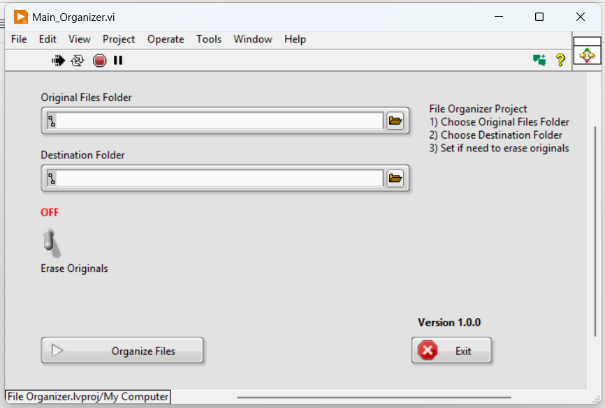
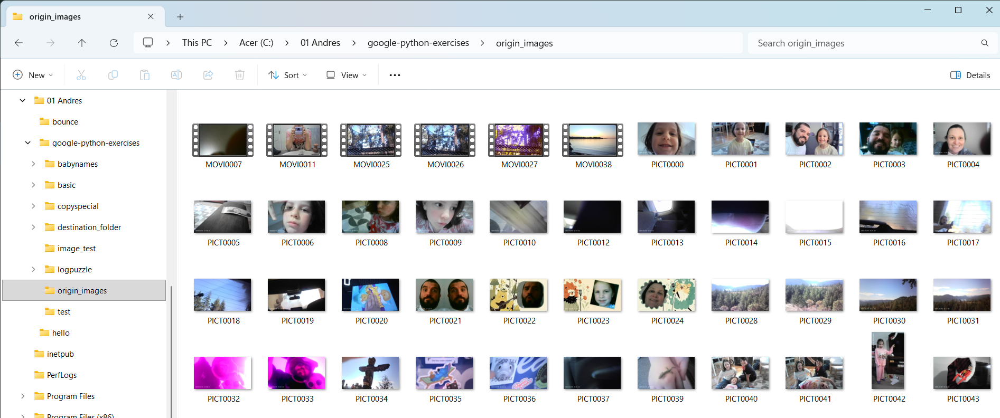
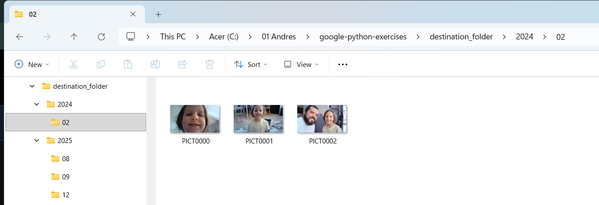

# FileOrganizer

File Organizer (Image Sorter) - LabVIEW
A robust LabVIEW application designed to automate the organization of cluttered file directories, specifically optimized for image libraries. The tool extracts creation metadata and sorts files into a clean, hierarchical folder structure.

## Overview
Managing thousands of images can be overwhelming. This project provides a programmatic solution to scan a source folder and redistribute files into subfolders organized by Year and Month, based on the original file creation date.

## Key Features
Metadata Extraction: Automatically retrieves "Date Created" information from file headers.
Dynamic Directory Creation: Generates folders (e.g., 2024/05/) only if they don't already exist.
Batch Processing: Handles large volumes of files through an efficient iterative loop.
Visual Feedback: (Optional: include if you have a progress bar) Real-time tracking of the sorting process on the Front Panel.
File Safety: Designed to handle file path conflicts and prevent data loss.

## How It Works
Select Source: The user selects the directory containing the unorganized files.
Select Destination: The user defines where the organized library should be built.
Process:
The application uses the Get File Info VI to read the timestamp of each file.
The timestamp is parsed into Year and Month strings.
The program checks for the existence of the target path.
The file is moved/copied to its new chronological home.

## User Interface

*Simple and intuitive interface for folder selection and process monitoring.*

## Preview
| **Before (Unorganized)** | **After (Sorted by Date)** |
| :---: | :---: |
|  |  |
| *Cluttered source folder* | *Structured output (Year/Month)* |

## Requirements
Software: LabVIEW 20xx (or later).
OS: Windows/Linux/macOS (Compatible with standard file systems).

